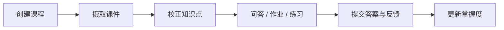

# 期末复习助手

把课件变成可追溯、可练习、可持续更新的个人复习工作区。

项目以“课程”为业务边界，将课件解析、知识整理、AI 问答、作业解答、练习判分和掌握度更新连接成完整学习闭环。所有数据与服务均可在本地部署。

> 当前版本面向单用户、单端场景，不提供注册登录、权限、多租户，也不区分学生端和教师端。请仅在可信网络环境中运行。

## 核心功能

- **课程工作区**：课件、作业、对话、练习、进度和用量按课程隔离。

- **课件知识化**：预检并解析 PDF、PPTX、DOCX、TXT、Markdown，提取知识点并建立向量索引。

- **可追溯问答**：AI 回答附带来源课件、页码和内容摘要；知识点可编辑并重新索引。

- **流式作业解答**：逐题生成答案，断开页面后后台继续，失败时只重试未完成题目。

- **练习与掌握度**：支持出题、作答、判分、历史记录、自动掌握判断和人工覆盖。

- **可靠性与成本控制**：任务可恢复、请求可幂等重连，并统一记录 AI 用量和每日预算。

## 学习闭环



## 技术与结构

| 模块 | 技术 |
| --- | --- |
| Web | React 18、TypeScript、Vite 8、Tailwind CSS |
| API | FastAPI、Pydantic 2、SQLAlchemy 2、Alembic |
| 数据 | PostgreSQL 15、pgvector |
| AI | DeepSeek、OpenAI、Anthropic、通义千问、DashScope Embedding |
| 测试 | Pytest、Vitest、Testing Library |

```text
apps/
├─ api/
│  ├─ alembic/                    # 数据库迁移
│  ├─ src/review_assistant/
│  │  ├─ domain/                  # 领域规则
│  │  ├─ application/             # 业务流程与后台任务
│  │  ├─ infrastructure/          # 数据库、AI、文档与计量适配器
│  │  └─ interfaces/http/         # FastAPI 接口
│  └─ tests/
└─ web/
   └─ src/
      ├─ app/                     # 应用装配
      ├─ features/                # 业务功能
      └─ shared/                  # 通用 API、SSE、类型和 UI

docs/                             # 业务规格与架构决策
CONTEXT.md                        # 领域术语与核心约束
```

## 五分钟启动

需要 Python 3.11+、[uv](https://docs.astral.sh/uv/)、Node.js 20.19+ 或 22.12+，以及 Docker Desktop。

以下命令均在仓库根目录执行。

### 1. 创建配置

```powershell
Copy-Item .env.example .env
```

打开 `.env`，至少填写一个文本生成模型的 API Key。使用知识向量化和语义检索时，还需填写 `DASHSCOPE_API_KEY`。

### 2. 安装依赖

```powershell
uv sync --project apps/api --extra dev
npm install
```

### 3. 启动数据库

```powershell
docker compose up -d db
npm run db:upgrade
```

可用 `npm run db:status` 检查迁移状态，正常结果为 `010 (head)`。

### 4. 启动应用

终端一：

```powershell
npm run dev:api
```

终端二：

```powershell
npm run dev:web
```

| 服务 | 地址 |
| --- | --- |
| Web | <http://localhost:5173> |
| API 文档 | <http://localhost:8000/docs> |
| 健康检查 | <http://localhost:8000/api/health> |

## AI 配置

建议显式填写厂商和模型，避免不同运行环境自动选择不同服务。

```env
AI_PROVIDER=deepseek
AI_DEFAULT_MODEL=deepseek-chat
DEEPSEEK_API_KEY=your-key

EMBEDDING_PROVIDER=dashscope
EMBEDDING_MODEL=text-embedding-v4
DASHSCOPE_API_KEY=your-key
```

| 文本生成厂商 | `AI_PROVIDER` | 密钥变量 |
| --- | --- | --- |
| DeepSeek | `deepseek` | `DEEPSEEK_API_KEY` |
| OpenAI | `openai` | `OPENAI_API_KEY` |
| Anthropic | `anthropic` | `ANTHROPIC_API_KEY` |
| 通义千问 | `qwen` | `DASHSCOPE_API_KEY` |

当 `AI_PROVIDER` 和 `AI_DEFAULT_MODEL` 留空时，后端会根据已配置的密钥自动选择厂商。修改 `.env` 后需要重启 API。

## 开发与验证

| 命令 | 用途 |
| --- | --- |
| `npm run dev:api` | 启动 FastAPI 开发服务 |
| `npm run dev:web` | 启动 Web 开发服务 |
| `npm run db:upgrade` | 升级数据库到最新版本 |
| `npm run db:status` | 查看数据库迁移版本 |
| `npm run test:api` | 运行 API 测试 |
| `npm run test:web` | 运行 Web 测试 |
| `npm run check` | 运行全部测试、类型检查和生产构建 |
| `npm audit` | 检查前端依赖安全问题 |

## 数据与边界

- PostgreSQL 数据保存在 `data/pgdata/`，上传文件保存在 `uploads/`。

- `.env`、运行数据、依赖、虚拟环境、缓存和构建产物均不会提交 Git。

- 不要随意执行 `docker compose down -v` 或删除 `data/pgdata/`，否则可能丢失本地数据。

- 文本问答与向量化是两个独立服务；问答可用不代表语义检索已经正确配置。

- 本项目不是多人教学平台，也不适合直接暴露到公网。

## 延伸文档

- [业务验收规格](docs/specs/business-closure-refactor.md)

- [领域上下文与术语](CONTEXT.md)

- [架构决策：单仓应用布局与深模块边界](docs/architecture/ADR-001-monorepo-and-deep-modules.md)
